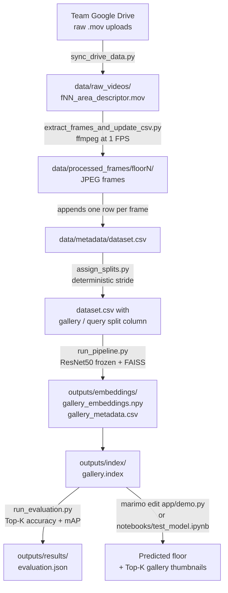

# IE Tower Visual Place Recognition

## Project overview

This repository hosts a modular Visual Place Recognition (VPR) pipeline for the IE Tower. Given a photo of an indoor location anywhere in the building it returns the most likely floor — across the 21 above-ground floors and 4 basement levels the team recorded — together with the closest gallery frames.

The pipeline is intentionally small and decoupled: each step is a standalone script, every artifact is reproducible from the script that produced it, and the feature-extractor backbone, FAISS metric, frame rate, and split strategy are all swap-in/swap-out parameters.

**Current best configuration** (full dataset, 2877 frames, 25 labels, CPU inference):

| Metric | Value |
|---|---|
| Top-1 accuracy | **52.8 %** |
| Top-5 accuracy | 72.0 % |
| mAP            | **57.7 %** |
| Backbone       | DINOv2 ViT-S/14 at 518×518, frozen |
| Index          | FAISS Flat-IP over L2-normalised embeddings |
| Held-out queries | ~430, stride-based per video |

These are the numbers we agreed to merge to `main`. The next iteration will tackle the documented failure modes (vertical confusion across above-ground floors, single-pass-per-floor data) — see "Analysis: why isn't accuracy higher?" near the bottom of this file.

The interactive layer is split between a Marimo dashboard (`app/demo.py`) and a Jupyter notebook (`notebooks/test_model.ipynb`). The core pipeline lives in regular Python modules under `src/` and `scripts/`, so contributions to feature extraction, retrieval or evaluation can land independently.

---

## Pipeline at a glance



`scripts/run_all.py` is a thin wrapper that runs every stage in order and **auto-skips** stages whose output is already on disk and up to date. Each individual stage script is also idempotent on its own — re-running any of them does not duplicate rows, re-download files, or rebuild anything already in sync.

## Quick start (one command)

Assumes your videos are already uploaded to the team Drive with the canonical naming convention (see "Team data ingestion" below).

```bash
# 1. Install dependencies (ffmpeg ships via imageio-ffmpeg, no system install needed).
pip install -r requirements.txt

# 2. Run the entire pipeline. Auto-skips stages whose output is already on disk.
python scripts/run_all.py

# 3. Open the demo (one of these):
marimo edit app/demo.py                                # Marimo web app
jupyter notebook notebooks/test_model.ipynb           # Jupyter notebook
```

That's it. `run_all.py` orchestrates 5 stages and **detects what is already done** so a second run is essentially instantaneous:

| Stage | What it does | Skip condition |
|---|---|---|
| 1. SYNC | `gdown` the Drive folder into `data/raw_videos/` and rename every legacy upload to the canonical `fNN_<area>_<descriptor>.<ext>`. | `data/raw_videos/` already has at least 10 canonical videos. |
| 2. EXTRACT | Run ffmpeg at 1 FPS over every video, write JPEGs to `data/processed_frames/floorN/`, append rows to `data/metadata/dataset.csv`. | Every video in `data/raw_videos/` already has frames on disk. |
| 3. SPLITS | Populate `dataset.csv`'s `split` column with a deterministic stride-based gallery / query partition. | Every CSV row already has a non-empty `split`. |
| 4. PIPELINE | Extract ResNet50 embeddings, save them, and build a FAISS Flat-IP index. | `gallery_embeddings.npy`, `gallery_metadata.csv`, and `gallery.index` all exist. |
| 5. EVAL | Compute Top-1 / Top-5 accuracy and mAP, write `outputs/results/evaluation.json`. | `evaluation.json` already exists. |

**Force a re-run** of one stage with `--force-sync`, `--force-extract`, `--force-splits`, `--force-pipeline`, or `--force-eval`. Force everything with `--force`. Skip a stage entirely (e.g. offline) with `--skip-sync` and friends.

### Standalone stage scripts (advanced)

If you want to run a single stage manually instead of going through `run_all.py`:

```bash
python scripts/sync_drive_data.py
python scripts/extract_frames_and_update_csv.py
python scripts/assign_splits.py
python scripts/run_pipeline.py
python scripts/run_evaluation.py
```

Each is idempotent and re-uses what is already on disk.

---

## Repository Structure

```text
ie-tower-visual-place-recognition/
├── app/
│   └── demo.py                # Marimo notebook for interactive testing
├── data/
│   ├── metadata/dataset.csv   # The single source of truth for the dataset
│   ├── processed_frames/      # Extracted JPGs (gitignored)
│   └── raw_videos/            # Source videos pulled from Drive (gitignored)
├── outputs/
│   ├── embeddings/            # .npy + metadata CSV
│   ├── index/                 # FAISS index files
│   └── results/               # evaluation.json
├── scripts/
│   ├── assign_splits.py                 # Populate the split column
│   ├── build_index.py                   # FAISS index from existing embeddings
│   ├── extract_embeddings.py            # Standalone embedding extraction
│   ├── extract_frames_and_update_csv.py # Video -> frames -> CSV (append mode)
│   ├── run_evaluation.py                # Top-K accuracy + mAP -> JSON
│   ├── run_pipeline.py                  # Full pipeline: embeddings + index
│   ├── run_query.py                     # CLI single-image query
│   └── sync_drive_data.py               # gdown wrapper for the team Drive
├── src/
│   ├── data/                  # Dataset loader, frame extractor
│   ├── evaluation/            # Metrics and evaluation orchestration
│   ├── features/              # ResNet50 feature extractor + transforms
│   ├── retrieval/             # FAISS index + search helpers
│   └── utils/                 # Config (paths) + IO helpers
├── requirements.txt
├── README.md
└── LICENSE
```

---

## Team data ingestion

### Drive folder

All raw videos live in the shared Google Drive folder: <https://drive.google.com/drive/folders/1b37B-V67FRRttLNrbHQ0bk4uywsZpiDH>.

The folder must remain shared as **"anyone with the link can view"** so `gdown` can enumerate it without OAuth.

### Coverage by team member

| Member | Labels | CSV rows | Frames in repo | Raw videos in Drive |
|-------|--------|---------|----------------|---------------------|
| Ariel | `floor10..16` | ✅ 925 | ✅ committed (`data/processed_frames/floor10..16/`) | ✅ 33 videos |
| Sebas | `floor3..9` | ✅ 759 | ✅ committed (`data/processed_frames/floor3..9/`) | ✅ 28 videos |
| Farah | `floor17..23` | ✅ 721 | ✅ committed (`data/processed_frames/floor17..23/`) | ✅ 30 videos |
| Ayo | `basement0`, `basement2`, `basement3`, `basement4` | ✅ 472 | ✅ committed (`data/processed_frames/basement{0,2,3,4}/`) | ✅ 32 videos |
| **Total** | **25 labels** | **2877** | **all on disk** | **123 videos** |

**First run after a fresh clone — any machine, 3 commands:**
```bash
# 1. Install (ffmpeg ships via imageio-ffmpeg, no system install needed).
pip install -r requirements.txt

# 2. Build the feature gallery and the FAISS index. The team's frames are
#    already committed, so this skips video extraction and goes straight
#    to the model. Pass --model-name to pick a backbone other than
#    resnet50 (recommended: dinov2_vits14_hires for production-quality
#    metrics, dinov2_vits14 for fast iteration).
python scripts/run_pipeline.py --model-name dinov2_vits14_hires
python scripts/run_evaluation.py

# 3. Open the test notebook (Jupyter) or the Marimo dashboard.
jupyter notebook notebooks/test_model.ipynb
# or:
marimo edit app/demo.py
```

If you also want to re-pull the raw videos from Drive (e.g. after a new team member uploads more), call `python scripts/run_all.py` instead — it auto-skips stages whose output is already up to date and only redoes what is genuinely missing.

### Canonical naming convention (rename in Drive before uploading)

Every video filename **must** match one of these two patterns:

```
fNN_<area>_<descriptor>.<ext>     # above-ground floors (f03 ... f23)
bN_<area>_<descriptor>.<ext>      # basement floors    (b0 ... b4)
```

- **Above-ground prefix `fNN`** — two-digit floor with leading zero (`f03`, `f04`, …, `f23`). The script normalises the dataset label to `floor3, floor4, …, floor23` (no leading zero).
- **Basement prefix `bN`** — one-digit floor (`b0`, `b2`, `b3`, `b4`). The script normalises the label to `basement0, basement2, basement3, basement4`. **`b3` is a separate physical floor from `f3`** — the basement label keeps them apart.
- `<area>` — canonical vocabulary: `central`, `classroom`, `elevator`, `hallway`, `stairs`, `open_area`, `studyroom`, `meetingroom`, plus the basement-only vocabulary Ayo introduced (`basement_lift`, `chill_lounge`, `food_corner`, `auditorium_main`, `pianolounge_ceiling`, `iestore_outside`, etc.). Any descriptive token is fine — the model only uses the floor label, not the area. Aliases: `class` → `classroom`, `classrom` → `classroom` (Ariel typo), `center` → `central`, `cafeteria` → `central`.
- `<descriptor>` — `main`, `left`, `right`, `right2`, `back`, `front`, `c025` (clip ID for multi-take captures), …
- `<ext>` — `mp4`, `mov`, `avi`, `m4v`. Uppercase extensions are normalised to lowercase automatically.

**Camera-suffix uploads** (Ayo's pattern): names like `b3_chill_lounge__A001_04081241_C029.mov` are accepted as-is. The sync script auto-strips the `__A001_<timestamp>_` portion and keeps the clip ID as the descriptor → `b3_chill_lounge_c029.mov`. No manual renaming required.

✅ Good: `f03_hallway_left.mp4`, `f17_classroom_main.mov`, `b3_chill_lounge_c029.mov`, `b0_basement_lift_c030.mov`
❌ Bad: `IMG_0123.mov`, `floor3-hallway.mp4`, `f3_hallway.mp4` (missing leading zero on above-ground)

### Documented equivalences

These exist for backward compatibility with Ariel's existing 879 rows and Farah/Sebas's vocabulary:

- **`stairs == bathroom`** — what Ariel labelled `*_stairs_*` is actually pictures of bathrooms in some floors. We keep the `stairs` token to avoid rewriting the existing CSV. New videos that show bathrooms should also use `stairs`.
- **`classroom == classrom`** — Ariel's CSV contains the typo `classrom`. Both spellings are accepted; new videos should prefer `classroom`.
- **`cafeteria == central`** — Farah originally tagged the f22 cafeteria as a separate area, but it is the same open central space. Collapsed into `central` so the label space stays small.

### Workflow when you upload new videos

1. Rename the videos **in the Drive UI** to match the convention above.
2. Pull them locally with `python scripts/sync_drive_data.py`. The script will warn (and exit non-zero) if anything is mis-named.
3. Run `python scripts/extract_frames_and_update_csv.py`. By default it runs in append mode, so it preserves the rows other team members already contributed.
4. Re-run `python scripts/assign_splits.py` so the new rows get a `gallery`/`query` assignment.
5. Commit the updated `data/metadata/dataset.csv` and push. The frames and videos themselves stay gitignored — share them through Drive only.

---

## Pipeline details

### Extracting embeddings & building the index

`python scripts/run_pipeline.py` does both in one shot. Key behaviours:

- Sets a global seed (`SEED = 42`) so the embeddings and FAISS index are reproducible.
- Loads every row in `data/metadata/dataset.csv` whose image file actually exists (`skip_missing=True`).
- Saves three artifacts under `outputs/`:
  - `outputs/embeddings/gallery_embeddings.npy` — float32 array, one feature vector per row. Shape depends on the backbone (2048 for ResNet50, 384 for DINOv2 ViT-S, 768 for DINOv2 ViT-B).
  - `outputs/embeddings/gallery_metadata.csv` — the matching CSV slice (image_path, label, split, ...).
  - `outputs/index/gallery.index` — the FAISS Flat-IP index over those embeddings, persisted via `serialize_index` + Python file I/O so it works on Windows paths with non-ASCII characters.

#### Backbone choice

The default backbone is **ResNet50** (ImageNet-pretrained, frozen). Switching to a stronger feature extractor is the single biggest accuracy lever — pass `--model-name <choice>` to swap it out:

```bash
python scripts/run_pipeline.py --model-name dinov2_vits14         # default-resolution DINOv2
python scripts/run_pipeline.py --model-name dinov2_vits14_hires   # 518x518 native res, slower
python scripts/run_pipeline.py --model-name dinov2_vitb14         # bigger DINOv2
python scripts/run_pipeline.py --model-name resnet50              # fallback
```

Empirical comparison on the full IE Tower dataset (2877 frames, 25 labels = 21 floors + 4 basements), CPU inference:

| Backbone | Top-1 | Top-5 | mAP | Pipeline time (CPU) |
|---|---|---|---|---|
| `resnet50` | 0.468 | 0.692 | 0.526 | ~6 min |
| `dinov2_vits14` (224x224) | 0.492 | **0.748** | 0.559 | ~6 min |
| `dinov2_vitb14` (224x224) | 0.494 | 0.724 | 0.560 | ~17 min |
| **`dinov2_vits14_hires`** (518x518) | **0.528** | 0.720 | **0.577** | ~25 min |

DINOv2 is self-supervised on 142M images and produces features that are more semantically organised than ImageNet-pretrained ResNet50, which is reflected in every metric. ViT-S vs ViT-B differ by less than 1 pp on this dataset but ViT-B is ~3x slower on CPU. Bumping ViT-S to its native 518x518 resolution (`_hires`) gives the strongest Top-1 and mAP (+3.6 pp / +1.8 pp over the 224 variant) at the cost of running ~4x slower because the ViT processes 5x more patches.

**Recommended defaults:**
- `dinov2_vits14` for fast iteration / low-end laptops.
- `dinov2_vits14_hires` for the final production index — best Top-1 and mAP.
- `resnet50` only as a sanity-check baseline.

Common overrides:

```bash
python scripts/run_pipeline.py --batch-size 32 --device cuda
python scripts/run_pipeline.py --metric l2          # use L2 instead of cosine
```

### Model artifacts — what gets saved and where

The "model" in this pipeline has two components, only one of which is saved by `run_pipeline.py`:

| Component | Saved by pipeline? | Where | Notes |
|---|---|---|---|
| Feature extractor (ResNet50, ImageNet pretrained, frozen) | **No** — auto-downloaded by torchvision on first use | `~/.cache/torch/hub/checkpoints/resnet50-11ad3fa6.pth` (~100 MB) | The `-11ad3fa6` in the filename is the SHA1 of the weights, so torchvision returns byte-identical weights for everyone. We never fine-tune or modify them, so saving a copy would only bloat the repo. |
| Gallery feature database (embeddings + FAISS index + metadata) | **Yes** | `outputs/embeddings/`, `outputs/index/` | This is the deployable artifact. The demo loads only these three files plus the frozen ResNet50. |

**Why no separate "model.pth" file?** Because the model is fully specified by `(torchvision version, ResNet50 weights URL)` plus the gallery database. The gallery database is what makes our specific dataset queryable. Re-running `run_pipeline.py` on the same CSV produces byte-identical artifacts thanks to the seed.

If you want to ship the full setup to someone offline, send them `outputs/embeddings/`, `outputs/index/`, and `~/.cache/torch/hub/checkpoints/resnet50-11ad3fa6.pth`. They can then run the demo without internet.

### Evaluating retrieval quality

```bash
python scripts/run_evaluation.py
```

This loads the saved embeddings + metadata, slices them by the `split` column, and computes Top-1 / Top-5 accuracy plus mAP using only the `query` rows against the `gallery` rows. Results are written to `outputs/results/evaluation.json`.

### Running a single CLI query

```bash
python scripts/run_query.py --image path/to/photo.jpg
```

### Two ways to test the model interactively

Both options need the pipeline to have produced `outputs/index/gallery.index` and `outputs/embeddings/gallery_metadata.csv` first (run `python scripts/run_pipeline.py` once).

**Option A — Marimo web app (recommended for the demo):**

```bash
marimo edit app/demo.py
```

Drag-and-drop a JPG/PNG into the upload widget, see a green banner with the predicted floor (majority vote across the Top-K) plus per-result thumbnails, scores, and labels. EXIF rotation is applied automatically so phone photos are upright.

**Option B — Jupyter notebook (recommended for the professor / quick test):**

```bash
jupyter notebook notebooks/test_model.ipynb
```

The notebook:

1. Loads the FAISS index, gallery metadata, and ResNet50 in three cells.
2. Defines `predict_floor(path)` and `show_results(path)` helpers.
3. Runs an example query against a randomly held-out frame so you immediately see Top-1/Top-K behaviour.
4. Has an "edit this path and re-run" cell at the bottom where you can drop your own image path.

Both options assume the pipeline has been built once. If the index files are missing, both surface a clear "Run `python scripts/run_pipeline.py` first" message instead of crashing.

---

## Analysis: why isn't accuracy higher?

Where we are on the full 25-label dataset (DINOv2 ViT-S at 518×518): **52.8 % Top-1, 72.0 % Top-5, 57.7 % mAP**. Going from ResNet50 to DINOv2 already gave us +6 pp on Top-1 and +5 pp on mAP — that was the cheap win from a stronger frozen backbone. The remaining ceiling has three structural causes:

1. **Vertical layout repetition.** The IE Tower repeats the same hallway, elevator and stairwell layout on almost every above-ground floor. ResNet50 / DINOv2 cannot read floor-number signage, so `floor10_hallway_left` and `floor15_hallway_left` look interchangeable in feature space. The per-class breakdown saved by `run_evaluation.py` makes this very visible — basements (architecturally distinct) reach **77–87 %** Top-1, while the middle above-ground floors hover around **30–55 %**.
2. **Single-pass-per-floor data.** Every gallery frame and every query frame come from the *same* phone walkthrough at the same moment in time. With a stride-based split the nearest gallery neighbour for a query is usually a frame from the same continuous video, two seconds away. That makes the metrics easier to game than what a real user would see (a fresh photo on a different day with a different phone). The honest fix is *new data*, not a different model.
3. **Frozen, generic features.** All four backbones we benchmarked are pretrained on ImageNet (ResNet50) or LVD-142M (DINOv2). None of them has ever seen the IE Tower, so the feature space is generic, not place-specific. Without supervision signal there is a hard ceiling.

### Things to watch for when reading the numbers

- **Consecutive-frame leakage.** At 1 FPS, frames N and N+1 of the same walkthrough look near-identical, so Top-1 will always look optimistic. Increase `--every` in `assign_splits.py` to harden the split.
- **Class imbalance.** Some floors have more captured areas than others (Ariel's `floor10` has 7 areas, others 4–5). Global mAP is biased toward over-represented labels. Always read the per-floor breakdown alongside.
- **`stairs == bathroom` legacy alias.** A single label covers two visually distinct scenes on Ariel's floors. Expect a slightly lower per-class accuracy for `stairs` queries.
- **Empty `device` / `lighting` columns.** The split is stride-based, not condition-based. Do not interpret these metrics as evidence of robustness to a new phone or to a new lighting condition.
- **EXIF rotation** is already handled in `app/demo.py` and `notebooks/test_model.ipynb` via `ImageOps.exif_transpose`. If you build a new entry point, remember to do the same — otherwise iPhone uploads come in sideways and the prediction collapses.
- **Disk usage.** ~2.9 k JPEGs (~120 MB) committed under `data/processed_frames/`. Embeddings + FAISS index together stay below 50 MB and are gitignored.

### Next-iteration roadmap

Listed in expected-impact order. The plan is to merge the current configuration to `main` first (it is the best honest setup we have today), then tackle these on follow-up branches:

1. **Triplet-loss fine-tuning of a projection head.** Freeze DINOv2 ViT-S, train a small 2-layer MLP on top with positive pairs = same floor and negative pairs = different floor. Re-uses the existing gallery as supervision and is cheap to run. Typical gain on similar VPR datasets: **+5–15 pp** Top-1.
2. **Capture a second pass per floor.** Each location filmed a second time on a different day, different phone, different lighting. This is the only way to make the held-out queries honest and to break the consecutive-frame leakage. Adds work for the team, not for the model.
3. **OCR head for floor-number signage.** Run a tiny EasyOCR / Tesseract head on each query and route the prediction whenever a floor number is visible in the frame. Targets exactly the vertical-confusion failure mode.
4. **Test-time augmentation.** Multi-crop / multi-scale at inference, then average. Cheap to add, often **+1–2 pp**.
5. **Re-ranking with query expansion.** Initial Top-30 from FAISS, then re-search using the average of the top-K matches as a refined query. Standard image-retrieval trick.
6. **Bigger backbone / NetVLAD pooling.** Diminishing returns relative to (1)–(3) but useful once those are exhausted.

---

## Troubleshooting

| Symptom | Likely cause / fix |
|---|---|
| `gdown` fails with "Failed to retrieve folder contents" | Drive permissions changed. Confirm the folder is "anyone with the link can view". If Drive is rate-limiting, wait and retry. |
| `sync_drive_data.py` exits with code 2 | A file in the Drive does not match the canonical naming convention. The script lists the offending paths — rename them in Drive (not locally). |
| `extract_frames_and_update_csv.py` raises `Could not infer floor from video name` | The video filename does not start with `fNN_` (above-ground) or `bN_` (basement). Rename it in Drive, re-run sync. |
| `extract_frames` / ffmpeg fails with `No such file or directory` on a path that clearly exists (Windows + non-ASCII username, e.g. `Peña`) | Already handled — `src/data/extract_frames.py` converts every path it passes to ffmpeg (input video, output dir, ffmpeg binary itself) to its Windows 8.3 short form via `GetShortPathNameW`, so ffmpeg sees pure-ASCII paths like `C:\Users\JUANSE~1\…`. No system or username changes are needed. If you somehow still hit this, confirm the file exists with `Path(...).exists()` from Python and report it. |
| `run_pipeline.py` crashes with `FileNotFoundError` on a frame path | The CSV references frames that aren't on disk. Run `sync_drive_data.py` and `extract_frames_and_update_csv.py` again to regenerate the frames. |
| `run_evaluation.py` reports unexpectedly high Top-1 (>0.99) | Likely consecutive-frame leakage (see "What the metrics mean" #1). Increase `--every` in `assign_splits.py` and re-run, or capture a second pass of videos for honest queries. |
| `run_evaluation.py` falls back to "no split" mode | The CSV has no `split` column populated. Run `python scripts/assign_splits.py`. |
| Marimo demo shows "Setup required" | Embeddings or FAISS index are missing. Run `python scripts/run_pipeline.py`. |
| Marimo demo's prediction is sideways/wrong for an iPhone photo | The upload pipeline already handles EXIF rotation; if you still see issues, the photo's EXIF tag may be missing — re-export it from Photos. |
| `ffmpeg not found` | Install ffmpeg system-wide (`brew install ffmpeg`, `choco install ffmpeg`, or `apt-get install ffmpeg`) and ensure it is on `PATH`. |

---

## Reproducibility checklist

- `requirements.txt` lists every runtime dependency.
- `scripts/run_pipeline.py` calls `set_global_seed(42)` (Python, NumPy, PyTorch — including CUDA when available).
- `scripts/assign_splits.py` is deterministic (stride-based, no RNG).
- `scripts/extract_frames_and_update_csv.py` sorts the CSV by `(label, image_path)` before writing so `git diff` stays minimal.
- The Marimo demo applies EXIF transpose so query images render the same regardless of upload device.

Recommended Python: **3.11+** (tested on 3.11 and 3.14).

---

## License

This project is distributed under the license in [LICENSE](LICENSE).
